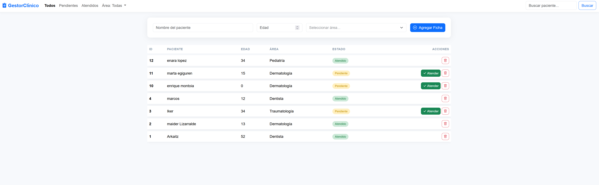
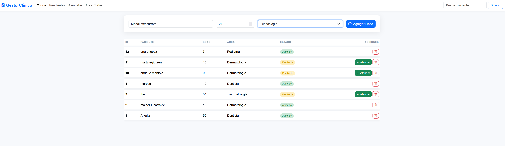
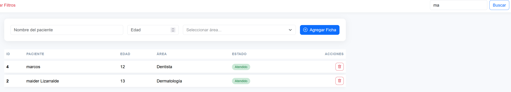
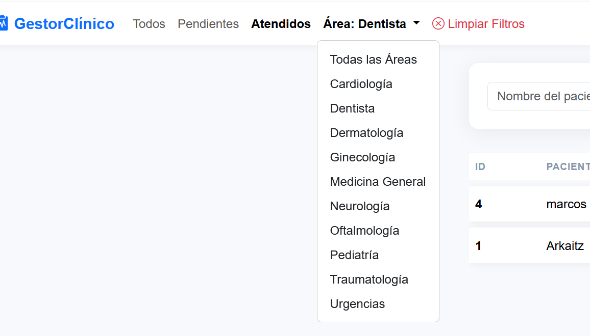
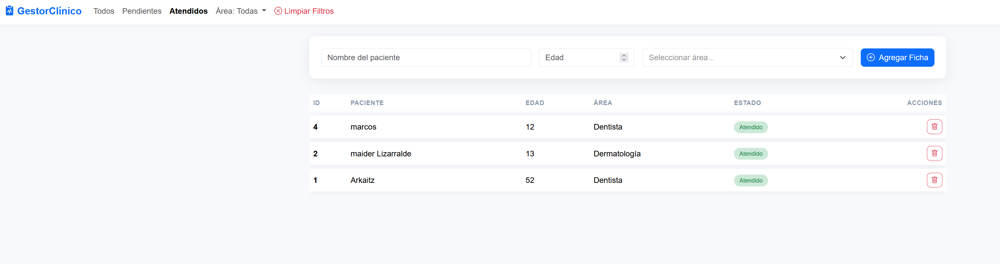
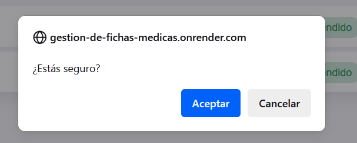
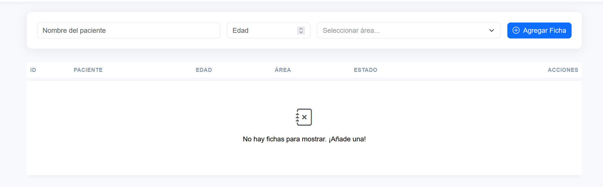
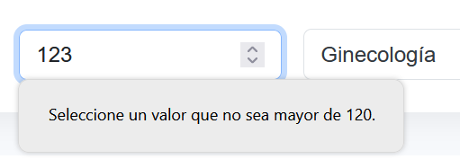

# Gestor de Fichas Médicas 🏥

  

Un sencillo pero potente sistema web para la gestión de fichas de pacientes, construido con Flask y desplegado en Render.

### [Ver Demo en Vivo 🚀](https://gestion-de-fichas-medicas.onrender.com/)

---



## Descripción del Proyecto

**GestorClínico** es una aplicación web que permite al personal administrativo o médico llevar un registro digital de las fichas de los pacientes. El objetivo es centralizar la información, permitiendo agregar, visualizar, filtrar y gestionar el estado de cada paciente de una forma rápida e intuitiva.

### ✨ Características Principales

* **Creación de Fichas:** Formulario para añadir nuevos pacientes con su nombre, edad y área médica.
* **Visualización Completa:** Tabla principal que muestra todos los pacientes con su información relevante.
* **Sistema de Filtros:** Permite filtrar la lista de pacientes por estado (`Pendientes`, `Atendidos`) y por área médica.
* **Búsqueda Dinámica:** Buscador integrado para encontrar pacientes por nombre.
* **Gestión de Estado:** Cambia el estado de un paciente de "Pendiente" a "Atendido" con un solo clic.
* **Eliminación Segura:** Opción para eliminar pacientes con un diálogo de confirmación.
* **Validación de Datos:** El formulario de edad verifica que los valores introducidos sean lógicos.
* **Interfaz Clara:** Muestra un mensaje claro cuando no hay resultados para los filtros seleccionados.

## 📸 Galería de Funcionalidades

<table>
  <tr>
    <td align="center"><strong>Creando una Ficha</strong></td>
    <td align="center"><strong>Búsqueda por Nombre</strong></td>
  </tr>
  <tr>
    <td></td>
    <td></td>
  </tr>
  <tr>
    <td align="center"><strong>Filtro por Área Médica</strong></td>
    <td align="center"><strong>Filtro por Estado</strong></td>
  </tr>
  <tr>
    <td></td>
    <td></td>
  </tr>
  <tr>
    <td align="center"><strong>Opción para Limpiar Filtros</strong></td>
    <td align="center"><strong>Confirmación para Eliminar</strong></td>
  </tr>
  <tr>
    <td></td>
    <td></td>
  </tr>
  <tr>
    <td align="center"><strong>Mensaje de "No Hay Resultados"</strong></td>
    <td align="center"><strong>Validación de Formulario</strong></td>
  </tr>
    <tr>
    <td></td>
    <td></td>
  </tr>
</table>

## 🛠️ Tecnologías Utilizadas

* **Backend:**
    * **Python:** Lenguaje principal de la aplicación.
    * **Flask:** Micro-framework web para gestionar las rutas y la lógica del servidor.
* **Frontend:**
    * **HTML5 / CSS3:** Estructura y estilos.
    * **Bootstrap 5:** Framework CSS para un diseño responsive y moderno.
    * **Tom Select:** Librería JavaScript para los selectores de búsqueda inteligentes.
* **Base de Datos:**
    * **SQLite:** Para el desarrollo local.
    * **PostgreSQL:** Para el entorno de producción en Render.
* **Servidor de Producción:**
    * **Gunicorn:** Servidor WSGI para ejecutar la aplicación Flask.
* **Despliegue:**
    * **Render:** Plataforma en la nube para alojar la aplicación y la base de datos.

## 🚀 Instalación y Uso Local

Sigue estos pasos para ejecutar el proyecto en tu máquina local.

### Prerrequisitos

* Tener instalado [Git](https://git-scm.com/).
* Tener instalado [Python 3.8](https://www.python.org/downloads/) o superior.

### Pasos

1.  **Clonar el repositorio:**
    ```shell
    git clone [https://github.com/Zubiarka8/Gestion-de-Fichas-Medicas.git](https://github.com/Zubiarka8/Gestion-de-Fichas-Medicas.git)
    ```

2.  **Navegar a la carpeta del proyecto:**
    ```shell
    cd Gestion-de-Fichas-Medicas
    ```

3.  **Crear un entorno virtual:**
    ```shell
    python -m venv venv
    ```

4.  **Activar el entorno virtual:**
    * En Windows:
        ```shell
        .\venv\Scripts\activate
        ```
    * En macOS y Linux:
        ```shell
        source venv/bin/activate
        ```

5.  **Instalar las dependencias:**
    ```shell
    pip install -r requirements.txt
    ```

6.  **Ejecutar la aplicación:**
    ```shell
    python app.py
    ```

7.  **Abrir en el navegador:**
    Abre tu navegador y ve a `http://127.0.0.1:5000`

---